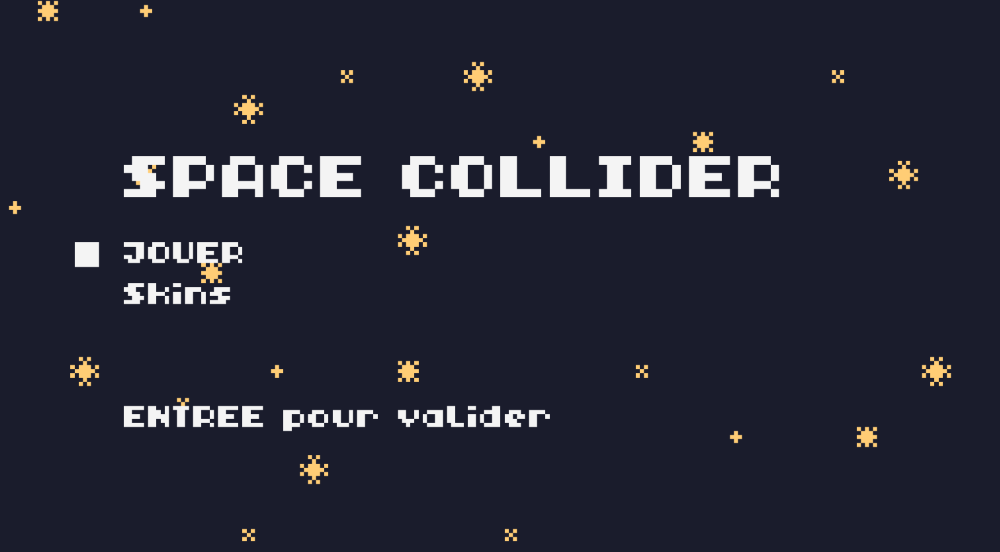
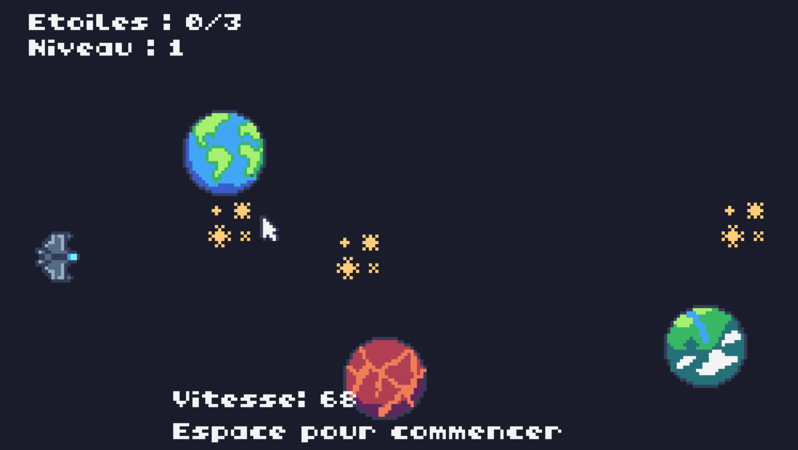
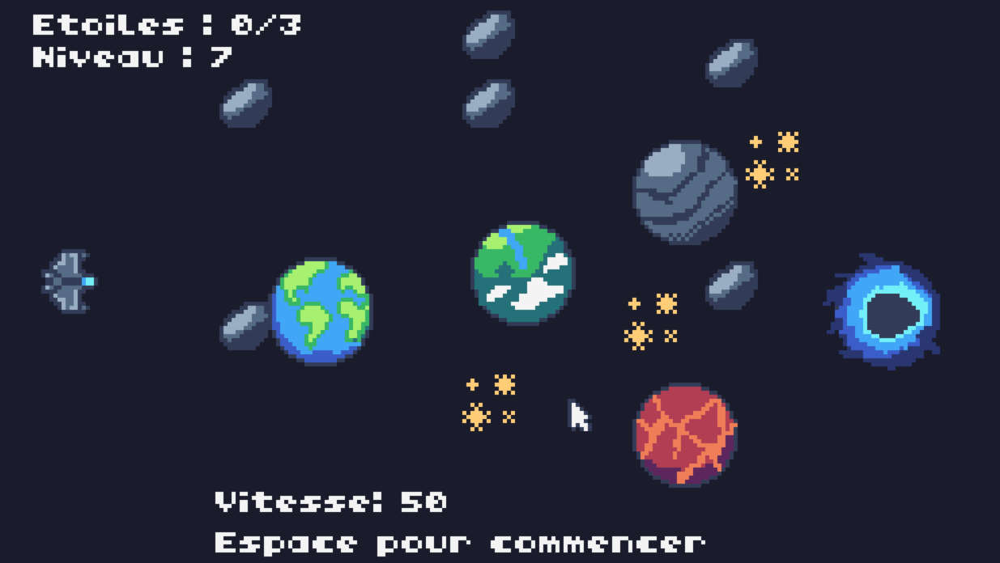
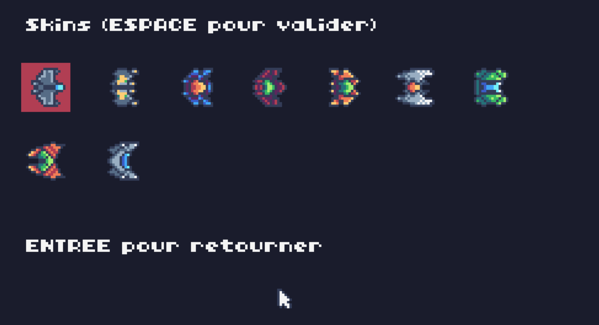

# 🌌 Space Collider

**Développé par la Brigade anti-virus**, l'équipe est composée de :
- ABOUBAKAR Abdoul Malik
- DE FAVERI SERRE Thomas
- GROSY Diwan
- RABEMAHEFA Mathieu

---

## 🎯 But du jeu

**Space Collider** est un jeu de simulation de gravité. Le joueur est dans la place d'un vaisseau situé dans un univers entouré de planètes, d'étoiles et d'astéroïdes.

**L'objectif est de :**
- Jouer avec la gravité afin de collecter toutes les étoiles du niveau.
- Éviter les astéroïdes qui feraient réinitialiser le niveau.

**Captures d'écrans :**





---

## 🚀 Spécificités techniques de notre projet

Même avec de fortes contraintes logicielles, notre projet présente tout de même des spécificités techniques intéressantes :

- Un système réaliste de gravité
- Une expérience de jeu riche et multi-niveaux
- Une possibilité de personnalisation du jeu

---

## 🛠️ Utilisation des outils

Divers outils ont été utilisés (dont notamment GitHub Desktop, le NextCloud de l'université *avec OnlyOffice*, les outils fournis de la TIC-80).

Des outils IA ont été également utilisés, dont notamment :
- **Google Antigravity** (éditeur IA)
- **Le navigateur IA Norton Neo**
- Divers agents conversationnels (ChatGPT, Gemini, Perplexity)

---

## 💻 Comment lancer le jeu

Si vous disposez de TIC-80, vous pouvez lancer le projet en ouvrant un terminal à la racine du dossier et en exécutant :

```bash
tic80 --skip --fs . --cmd="load assets/game.tic & import code src/main.fnl & run"
```
